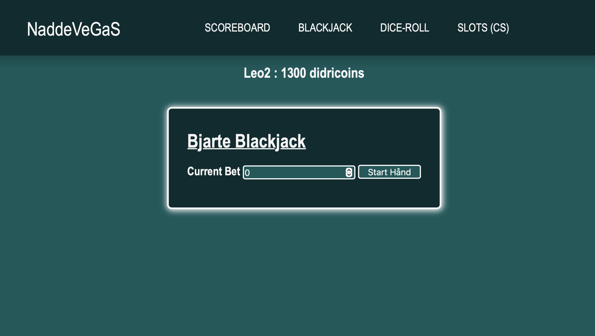

# NaddeVeGaS

Welcome to NaddeVeGaS, a web project created as part of a high school assignment together with a classmate. This project features a simple online casino game platform, including games such as Blackjack, Dice-Roll, and a scoreboard to keep track of your scores. The project was developed to demonstrate our understanding of web development concepts. 

# Screenshot

## Project Description
NaddeVeGaS is a web-based casino game platform created as a class project. The platform includes the following games:
- Blackjack
- Dice-Roll

The main goal of this project was to apply our knowledge of HTML, CSS, and JavaScript in a practical way.

## Features
- **Blackjack**: A classic card game where the goal is to get as close to 21 points as possible without exceeding it.
- **Dice-Roll**: A simple game of chance where players roll dice and try to achieve the highest score.
- **Scoreboard**: Keeps track of the current balance of all the players
- **Responsive Design**: The website is designed to be responsive and works well on various screen sizes.
- **Hamburger Menu**: A responsive navigation menu for easy access on mobile devices.

## Technologies Used
- **HTML**: For the structure of the web pages.
- **CSS**: For styling the web pages.
- **JavaScript**: For adding interactivity to the web pages.
- **Firebase**: For backend services (e.g., Firestore for storing scores).

# naddevegas
# naddevegas
# casino
